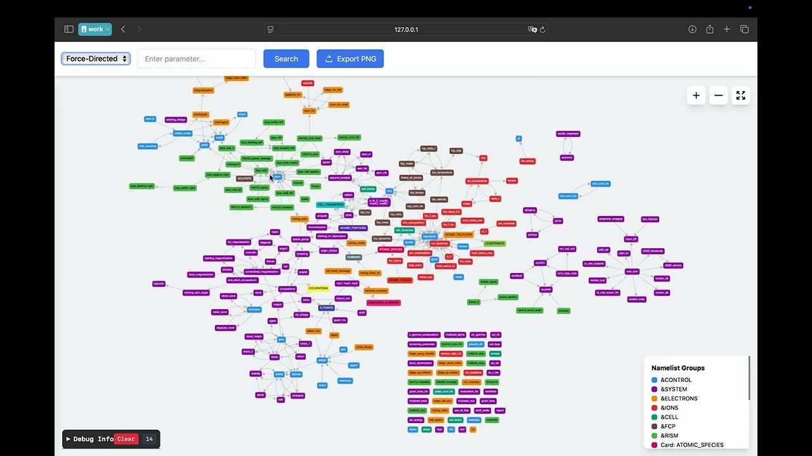
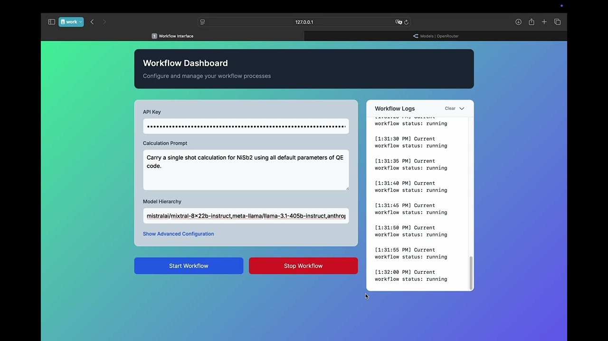

# QE Workflow Management System

## Overview
This is a Quantum ESPRESSO (QE) Workflow Management System that provides a web-based interface for managing and executing Quantum ESPRESSO workflows. The system uses a knowledge graph approach for retireval of relevant Quantum ESPRESSO parameters and organizes the workflow using a finite state machine and includes both backend and frontend components.

## Showcase Videos

### Knowledge Graph Interface Demo

[](https://youtu.be/1hlE7Wees3c) 🎥

This video showcases an interactive web interface for exploring and interacting with the Quantum ESPRESSO knowledge graph. The interface provides a dynamic visualization of Quantum ESPRESSO parameters, their relationships, and dependencies. Click the image above to watch on YouTube.

### Workflow Management Demo

[](https://youtu.be/Gf7AS_UhxX4) 🎥

This video demonstrates how to initiate, configure, and monitor Quantum ESPRESSO workflows through the web interface. It shows the step-by-step process of setting up calculations and tracking their execution status in real-time, and viewing the final results of the workflow. Click the image above to watch on YouTube.

## Project Structure

```
.
├── workflow_server.py        # Main FastAPI server application
├── qe_knowledge_graph.py     # Knowledge graph implementation
├── requirements.txt          # Python dependencies
├── setup_qe_wf.sh           # Installation script
├── uninstall_qe_wf.sh       # Uninstallation script
├── wf-tech-doc.md           # Technical documentation
├── .env.template            # Environment variables template
├── videos/                  # Video demonstrations
│   ├── kg_compressed.mp4    # Knowledge Graph interface demo (compressed)
│   ├── kg_thumbnail.jpg     # Knowledge Graph demo thumbnail
│   ├── wf_compressed.mp4    # Workflow interface demo (compressed)
│   └── wf_thumbnail.jpg     # Workflow demo thumbnail
├── eng/                     # Engineering core components
│   ├── interfaces/          # API and interface definitions
│   ├── fsm/                # Finite State Machine implementation
│   ├── core/               # Core functionality
│   └── assets/             # Engineering assets
├── templates/               # HTML templates
│   ├── index.html          # Main landing page
│   └── wf_app.html         # Workflow application interface
├── static/                 # Static assets for web interface
├── total results/          # Output storage directory
│   ├── concat_json/       # JSON format results
│   └── concat_png/        # PNG format results
├── new_pp/                # Pseudopotential directory
└── analysis/             # Analysis tools and results
    ├── embeddings/       # Embedding analysis
    └── som/             # Self-organizing maps
```

## Components

### Backend Components

1. **Workflow Server (`workflow_server.py`)**
   - FastAPI-based server implementation
   - Runs on localhost (default port range: 8001-8019)
   - Supports auto-reload for development
   - Handles workflow API endpoints

2. **Knowledge Graph (`qe_knowledge_graph.py`)**
   - Implements workflow organization logic
   - Manages relationships between workflow components
   - Provides graph-based workflow navigation

3. **Engineering Module (`eng/`)**
   - **Interfaces**: API definitions and interface implementations
   - **FSM**: Finite State Machine for workflow state management
   - **Core**: Core business logic and functionality
   - **Assets**: Engineering-related resources

### Frontend Components

1. **Templates**
   - `index.html`: Main landing page template
   - `wf_app.html`: Workflow application interface template

2. **Static Assets**
   - Contains CSS, JavaScript, and other static resources
   - Supports web interface styling and functionality

### Additional Components

1. **Analysis Tools**
   - Directory for analysis scripts and tools
   - Results storage and processing

2. **Processing Pipeline**
   - New processing pipeline implementations
   - Workflow execution components

## Dependencies

The system requires the following key dependencies:

- FastAPI (0.115.8): Web framework for APIs
- Uvicorn (0.34.0): ASGI server implementation
- Pydantic (2.10.4): Data validation
- NetworkX (3.4.2): Graph operations
- Pandas (2.2.3): Data manipulation
- Scikit-learn (1.6.0): Machine learning utilities
- ASE (3.24.0): Atomic Simulation Environment
- Additional scientific computing and visualization libraries

## Setup and Installation

The installation process requires Miniconda. If you haven't installed it yet, please download it from: https://docs.conda.io/en/latest/miniconda.html

1. **Clone the Repository**

   Using git:
   ```bash
   git clone https://github.com/KIT-Workflows/agentic-workflow-framework.git
   cd agentic-workflow-framework
   ```

   Or using wget:
   ```bash
   wget https://github.com/KIT-Workflows/agentic-workflow-framework/archive/main.zip
   unzip main.zip
   cd agentic-workflow-framework-main
   ```

   Or using curl:
   ```bash
   curl -L https://github.com/KIT-Workflows/agentic-workflow-framework/archive/main.zip --output agentic-workflow-framework.zip
   unzip agentic-workflow-framework.zip
   cd agentic-workflow-framework-main
   ```

2. **Run the Installation Script**
   ```bash
   chmod +x setup_qe_wf.sh 
   ./setup_qe_wf.sh
   ```
   
   The script will:
   - Create two conda environments:
     - `qe_wf`: Main workflow environment with Python 3.11 and required dependencies
     - `qe`: Quantum ESPRESSO environment from conda-forge
   - Set up configuration by copying `.env.template` to `.env`

3. **Configure API Keys**
   - Get your API key from [OpenRouter](https://openrouter.ai/keys)
   - Copy the `.env.template` to `.env` if not already done:
     ```bash
     cp .env.template .env
     ```
   - Edit the `.env` file and replace the placeholder with your API key:
     ```bash
     # .env file
     LM_API="your_openrouter_api_key_here"  # Replace with your actual API key
     ```

4. **Post-Installation**
   - Activate the environment:
     ```bash
     conda activate qe_wf  # For the main workflow environment
     ```
   - Start using the workflow system

## Usage

This system comprises two main FastAPI-based server applications:

1.  **Workflow Server (`workflow_server.py`)**:
    *   **Purpose**: Manages and executes quantum engineering workflows. This is the primary server for workflow operations.
    *   **How to run**:
        ```bash
        python workflow_server.py
        ```
    *   **Access**: The web interface will be accessible at `http://localhost:PORT`, where `PORT` is an automatically selected available port in the range 8001-8019. The console output will indicate the chosen port.
    *   **Functionality via interface**:
        *   Create and manage workflows
        *   Monitor workflow execution
        *   Analyze results

2.  **Knowledge Graph Server (`qe_knowledge_graph.py`)**:
    *   **Purpose**: Provides an API and potentially a visual interface to explore the Quantum ESPRESSO knowledge graph, which underpins the workflow organization. It can be run independently for KG exploration or development.
    *   **How to run**:
        ```bash
        python qe_knowledge_graph.py
        ```
    *   **Access**: This server will also find an available port, typically starting from 8001 (and incrementing if busy), in the range 8001-8019. Check the console output for the exact port. It serves a landing page at its root (`/`) and data at `/api/data`.

**Note on Ports**: Both servers attempt to find an available port in the range 8001-8019. If you run both simultaneously, they will occupy different ports from this range. Pay attention to the terminal output of each server to identify which port it is running on.

## Uninstallation

To completely remove the QE Workflow system:

1. **Run the Uninstallation Script**
   ```bash
   chmod +x uninstall_qe_wf.sh
   ./uninstall_qe_wf.sh
   ```

   The script will:
   - Remove both conda environments (`qe_wf` and `qe`)
   - Delete the entire repository directory including:
     - All local changes
     - Configuration files (`.env`)
     - Any additional data or results

2. **Manual Cleanup (if needed)**
   - If you installed any global packages or made system-wide changes, you may need to remove those manually
   - The script will notify you if any components couldn't be removed automatically

## Documentation

For detailed technical documentation, refer to:
- `wf-tech-doc.md`: Technical documentation
- `eng_directory_structure.txt`: Directory structure

## Development

The system supports development mode with auto-reload enabled. The server will automatically restart when code changes are detected.

## Notes

- The server automatically finds an available port in the range 8001-8019
- The system uses a knowledge graph approach for retrieval of relevant Quantum ESPRESSO parameters
- Frontend templates are rendered using Jinja2
- The system includes comprehensive logging 